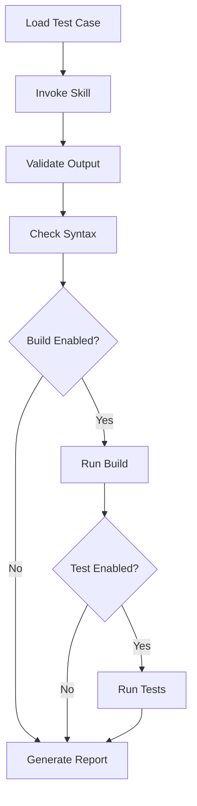
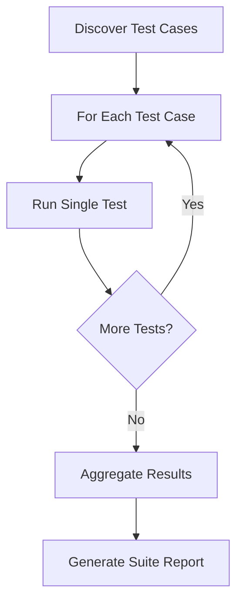

# Skill Tester

A comprehensive testing skill for Claude Code that validates other skills using a hybrid approach combining output validation, syntax checking, build execution, and test running.

## Overview

The skill-tester provides automated, reproducible testing for Claude Code skills, particularly those that generate C# code. It validates:

- ✅ **Output Files** - Checks files are created with expected content
- ✅ **Syntax** - Validates C# code is well-formed
- ✅ **Build** - Runs `dotnet build` to ensure compilation succeeds
- ✅ **Tests** - Executes `dotnet test` to verify tests pass

## Quick Start

### Using the Skill

In Claude Code, simply invoke:

```
Test the test-suite-builder skill with test case TC-TSB-001
```

Or for full test suite:

```
Run all tests for blazor-component-generator
```

### Manual Script Execution

**Both Bash (.sh) and PowerShell (.ps1) scripts are provided!**

Choose your preferred shell:

#### Option 1: Bash (Git Bash / WSL / Linux / Mac)

Run a single test case:

```bash
cd .claude/skills/skill-tester
./scripts/run-skill-test.sh test-suite-builder TC-TSB-001
```

Run validation scripts individually:

```bash
# Output validation only
./scripts/validate-output.sh test-cases/test-suite-builder.yaml ./workspace

# Build validation only
./scripts/run-build-test.sh ./workspace/MyProject.csproj

# Test execution only
./scripts/run-unit-tests.sh ./workspace/MyProject.Tests.csproj --coverage
```

#### Option 2: PowerShell (Native Windows)

Run a single test case:

```powershell
cd .claude/skills/skill-tester
.\scripts\run-skill-test.ps1 test-suite-builder TC-TSB-001
```

Run validation scripts individually:

```powershell
# Output validation only
.\scripts\validate-output.ps1 test-cases\test-suite-builder.yaml .\workspace

# Build validation only
.\scripts\run-build-test.ps1 .\workspace\MyProject.csproj

# Test execution only
.\scripts\run-unit-tests.ps1 .\workspace\MyProject.Tests.csproj -Coverage
```

## Cross-Platform Support

**This skill works on ALL platforms!**

| Platform | Recommended Shell | Scripts to Use |
|----------|-------------------|----------------|
| **Windows** | PowerShell or Git Bash | `.ps1` or `.sh` |
| **Linux** | Bash | `.sh` |
| **macOS** | Bash / Zsh | `.sh` |
| **WSL** | Bash | `.sh` |

**Why both .sh and .ps1?**
- ✅ **Maximum compatibility** - Works for all Windows users
- ✅ **Native experience** - PowerShell feels native on Windows
- ✅ **Choice** - Use whichever you prefer
- ✅ **Same functionality** - Both do exactly the same thing

**Which should you use?**
- Have Git Bash? Either works!
- Prefer PowerShell? Use `.ps1` files
- On Linux/Mac? Use `.sh` files
- CI/CD pipeline? Either works!

## Directory Structure

```
skill-tester/
├── SKILL.md                       # Main skill definition
├── README.md                      # This file
├── scripts/                       # Validation scripts (both .sh and .ps1)
│   ├── run-skill-test.sh          # Main orchestrator (Bash)
│   ├── run-skill-test.ps1         # Main orchestrator (PowerShell)
│   ├── validate-output.sh         # File/pattern validation (Bash)
│   ├── validate-output.ps1        # File/pattern validation (PowerShell)
│   ├── run-build-test.sh          # Build execution (Bash)
│   ├── run-build-test.ps1         # Build execution (PowerShell)
│   ├── run-unit-tests.sh          # Test execution (Bash)
│   ├── run-unit-tests.ps1         # Test execution (PowerShell)
│   ├── generate-test-report.sh    # Report generation (Bash)
│   └── generate-test-report.ps1   # Report generation (PowerShell)
├── test-cases/                    # Test case definitions
│   ├── test-suite-builder.yaml
│   ├── blazor-component-generator.yaml
│   └── csharp-refactor-advisor.yaml
├── templates/                     # Templates for new content
│   ├── test-report.md.template
│   └── test-case.yaml.template
├── assets/                        # Configuration
│   └── test-config.json
└── reports/                       # Generated test reports (gitignored)
```

## Creating Test Cases

### 1. Copy the Template

**Bash:**
```bash
cp templates/test-case.yaml.template test-cases/my-skill.yaml
```

**PowerShell:**
```powershell
Copy-Item templates\test-case.yaml.template test-cases\my-skill.yaml
```

### 2. Fill in Test Details

```yaml
skill_name: my-skill
test_suite_version: "1.0"
description: Test suite for my-skill

test_cases:
  - id: TC-MYSKILL-001
    name: Test Basic Functionality
    priority: high
    input:
      user_request: "Generate a service class for Product"
      context_files: []
    expected_outputs:
      - file: src/Services/ProductService.cs
        patterns:
          - "class ProductService"
          - "IProductService"
          - "public async Task"
    validation:
      output_check: true
      syntax_check: true
      build_check: true
      test_check: false
```

### 3. Run Your Test

**Bash:**
```bash
./scripts/run-skill-test.sh my-skill TC-MYSKILL-001
```

**PowerShell:**
```powershell
.\scripts\run-skill-test.ps1 my-skill TC-MYSKILL-001
```

## Test Case Guidelines

### Test ID Format

Use consistent format: `TC-SKILLNAME-NNN`

- `TC-TSB-001` - test-suite-builder
- `TC-BLAZOR-001` - blazor-component-generator
- `TC-REFACTOR-001` - csharp-refactor-advisor

### Priorities

- **high** - Critical functionality, must pass before release
- **medium** - Important features, investigate failures
- **low** - Nice-to-have, informational

### Validation Flags

Choose appropriate validation levels for your skill type:

#### Code Generator Skills
```yaml
validation:
  output_check: true   # Always
  syntax_check: true   # For C# skills
  build_check: true    # If code should compile
  test_check: false    # Usually not needed
```

#### Test Generator Skills
```yaml
validation:
  output_check: true
  syntax_check: true
  build_check: true
  test_check: true     # Tests must run
```

#### Refactoring Skills
```yaml
validation:
  output_check: true
  syntax_check: true
  build_check: true
  test_check: true     # Ensure existing tests pass
```

#### UI Component Skills
```yaml
validation:
  output_check: true
  syntax_check: true
  build_check: true
  test_check: false    # UI needs runtime
```

### Pattern Matching Best Practices

Be specific but not overly strict:

✅ **Good patterns:**
```yaml
patterns:
  - "class ProductService"
  - "[Fact]"
  - "using Xunit"
  - "public async Task"
```

❌ **Too strict:**
```yaml
patterns:
  - "public class ProductService : IProductService, IDisposable"
  - "[Fact] public async Task GetProduct_WithValidId_ReturnsProduct()"
```

The good patterns check for essential constructs without being brittle to whitespace or minor changes.

## Common Patterns by Type

### Services
```yaml
- "class ServiceName"
- "IServiceInterface"
- "public async Task"
- "private readonly"
```

### Controllers
```yaml
- "[ApiController]"
- "[Route("
- "[HttpGet]"
- "IActionResult"
```

### Tests
```yaml
- "[Fact]"
- "[Theory]"
- "using Xunit"
- "// Arrange"
- "// Act"
- "// Assert"
- "Mock<"
- ".Should()"
```

### Blazor Components
```yaml
- "@page"
- "@inject"
- "RenderFragment"
- "EventCallback"
```

### Entity Framework
```yaml
- "DbContext"
- "DbSet<"
- "OnModelCreating"
- "HasKey"
```

## Test Reports

Test reports are generated in `reports/` directory:

```
reports/
├── test-suite-builder-TC-TSB-001-20250128-143022.md
├── blazor-component-generator-suite-20250128-150000.md
└── regression-20250128-160000.md
```

Each report includes:

- Test summary with status
- Detailed validation results
- Build/test output
- Recommendations
- Next steps

## Configuration

Edit `assets/test-config.json` to customize:

```json
{
  "default_settings": {
    "validation": {
      "output_check": true,
      "syntax_check": true,
      "build_check": true,
      "test_check": false
    },
    "timeouts": {
      "build_timeout_seconds": 300,
      "test_timeout_seconds": 600
    }
  },
  "success_criteria": {
    "minimum_coverage_percent": 80,
    "allow_build_warnings": false,
    "require_all_tests_pass": true
  }
}
```

## Workflows

### Workflow 1: Test Single Case



### Workflow 2: Full Test Suite



## Troubleshooting

### Scripts Don't Execute

**Problem:** Permission denied

**Solution:**
```bash
chmod +x scripts/*.sh
```

### YAML Parse Errors

**Problem:** Test case won't load

**Solution:**
- Validate YAML syntax online
- Check indentation (use spaces, not tabs)
- Ensure all required fields present

### Pattern Matching Fails

**Problem:** Expected patterns not found

**Solution:**
- Use simpler patterns
- Check for whitespace differences
- Review generated file content
- Test patterns independently with grep

### Build Validation Fails

**Problem:** dotnet build errors

**Solution:**
- Check project file exists
- Verify NuGet packages restored
- Ensure dotnet CLI in PATH
- Review build output for errors

### Test Validation Fails

**Problem:** Tests won't run

**Solution:**
- Check test project references
- Verify test framework installed
- Ensure tests discoverable
- Review test output

## Integration with Other Skills

Skill-tester works with:

- **skill-creator** - Test newly created skills
- **test-suite-builder** - Validate generated tests run
- **blazor-component-generator** - Ensure components compile
- **csharp-refactor-advisor** - Verify refactorings don't break tests
- **ace-framework** - Test agent implementations

## Examples

### Example 1: Test Suite Builder

**Bash:**
```bash
./scripts/run-skill-test.sh test-suite-builder TC-TSB-001
```

**PowerShell:**
```powershell
.\scripts\run-skill-test.ps1 test-suite-builder TC-TSB-001
```

**Expected:** Generates unit tests that compile and run successfully.

### Example 2: Blazor Component

**Bash:**
```bash
./scripts/run-skill-test.sh blazor-component-generator TC-BLAZOR-001
```

**PowerShell:**
```powershell
.\scripts\run-skill-test.ps1 blazor-component-generator TC-BLAZOR-001
```

**Expected:** Generates Blazor component that compiles (tests not run).

### Example 3: Full Regression

Test all skills:

**Bash:**
```bash
for test_suite in test-cases/*.yaml; do
    skill_name=$(basename "$test_suite" .yaml)
    ./scripts/run-skill-test.sh "$skill_name" "*"
done
```

**PowerShell:**
```powershell
Get-ChildItem test-cases\*.yaml | ForEach-Object {
    $skillName = $_.BaseName
    .\scripts\run-skill-test.ps1 $skillName "*"
}
```

## Performance

Typical execution times:

- **Output validation:** < 1s
- **Syntax check:** < 2s
- **Build validation:** 10-30s
- **Test execution:** 5-60s

Total time per test case: **15-90s**

Full test suite (8 test cases): **2-10 minutes**

## Best Practices

1. **Start Simple** - Begin with output validation only
2. **Add Incrementally** - Enable build/test validation after output works
3. **Test Early** - Run tests during skill development
4. **Document Limitations** - Note why validations are disabled
5. **Keep Patterns Simple** - Don't be overly strict with matching
6. **Version Test Suites** - Update tests when skills change
7. **Review Reports** - Learn from validation failures

## Future Enhancements

Potential improvements:

- Parallel test execution
- Snapshot testing (compare to baselines)
- Performance benchmarks
- Visual regression for UI components
- CI/CD integration (GitHub Actions)
- Test case generator (AI-assisted)
- Mutation testing

## Contributing

To add a new test case:

1. Copy `templates/test-case.yaml.template`
2. Fill in test details
3. Run the test to verify
4. Commit test case to repository

To improve validation scripts:

1. Edit script in `scripts/`
2. Test with existing test cases
3. Update documentation
4. Commit changes

## License

Part of SchaabCore framework - see repository license.

## Support

For issues or questions:

1. Check this README
2. Review SKILL.md for detailed workflows
3. Examine test case examples
4. Create issue in repository

---

**Happy Testing! 🧪**
